# Deep Learning in Data Science - Assignment 3

##### 3+ layer multi class classifier with ReLU activation and Batch Normalization, trained with SGD with momentum and L2 regularization

The overall goal of this third assignment is to add a Batch Normalization feature to the previously implemented multi layer network. We'll be testing the pros of the new layer using the CIFAR-10 image dataset. The network will be trained with stochastic mini-batch gradient descent with momentum, aiming at minimizing a loss function. The loss function used is the cross-entropy plus a regularization term.

## CIFAR-10 dataset

The Python version of the dataset is downloaded from [https://www.cs.toronto.edu/~kriz/cifar.html](https://www.cs.toronto.edu/~kriz/cifar.html).

The CIFAR-10 dataset consists of 60000 32x32 colour images in 10 classes, with 6000 images per class. There are 50000 training images and 10000 test images.

The dataset is divided into five training batches and one test batch, each with 10000 images. The test batch contains exactly 1000 randomly-selected images from each class. The training batches contain the remaining images in random order, but some training batches may contain more images from one class than another. Between them, the training batches contain exactly 5000 images from each class.

## Layer design and backpropagation

The individual layers used to compose the network can be classified as:
- Fully Connected
- ReLU Activation
- Batch Normalization
- Softmax Activation

These layers are modeled by the classes in the the file ```layers.py```. The general idea is that one layer will always have common properties (like a name, input size and output size) and methods (forward and backward pass), that are defined in the abstract class Layer.
Then the the specialized layers will only need to add their specific properties (e.g. regularization) and methods (e.g. backpropagation logic) and inherit the rest from Layer.

#### Fully Connected layer
Given an input x, applies the linear transformation
```
out = W x + b
```

The matrices ```W``` and ```b``` have sizes (output size x input size) and (output size x 1) resp.

During backpropagation this layer computes the gradients of matrices ```W``` and ```b``` to be used during the update step and pushes back the gradient to be used by the previous layers in the network.

Also, layers of this kind contribute to the cost function of the network if L2-regularization is used on the matrix ```W```.

#### ReLU Activation layer
Given an input x, applies the function
```
out = max(0, x)
```

There is no trainable parameter in this step, so during the backward pass there is no gradient to compute and we only need to propagate back the gradient to the previous layer.

#### "Batch Normalization" layer
Given as input a batch of samples X, applies this function to each sample x represented by one column of  X:
```
out = diag(Sigma)^(-1/2) * (x - mu)
```

During training:
* forward propagation: the layer receives a batch of inputs to transform and estimates the parameters ```mu``` and ```Sigma``` as the mean and the variance of the batch
* backward propagation: the layer receives a batch of gradients from the subsequent layer and uses the previously estimated parameters to propagate the gradients back to the previous layer

During testing:
* the parameters ```mu``` and ```Sigma``` are set to reflect the values of an exponential moving average that was updated during training

    avg_mean <- alpha * avg_mean + (1-alpha) * batch_mean

    avg_var <- alpha * avg_var + (1-alpha) * batch_var

#### Softmax Activation layer
Given an input x, applies the function
```
out = softmax(x)
```

Thanks to the properties of the softmax function, this output can be interpreted as class probabilities for a classification task. For this reason this layer is used at the end of our network.

During the backward pass the gradient for each sample is computed using the predicted class probabilities and its true label.

## Layer initialization
When it comes to initializing fully connected layers we can choose different strategies:
* zeros, typically used for the biases
* gaussian random values with zero mean and given variance, typically used for the weight matrices
* gaussian random values with zero mean and and variance that is a function of the output size (Xavier initialization), used to prevent the activations to "die" in deeper networks

These initializers and some small variations of them are implemented in the file ```initializers.py``` and can be passed to the constructor of a ```LinearLayer``` to initialize the weights and biases.

In this assignment we will always use a Xavier initialization.

## Stacking layers to build a network
A network is simply and abstraction over a stack of layers that takes care of feeding the inputs and retrieving the outputs layer by layer, other than computing some higher level metrics such as cost and accuracy over a dataset. The logic to build a generic network layer by layer is found in ```network.py```.

Moreover, inside ```utils.py``` we can find an helper function to build a network with the specific architecture for this assignment. In detail, with M representing the number of layers excluding the last one:

    INPUT -> [FC -> BN? -> ReLU] * M -> FC -> Softmax

## Optimization
The general optimization technique used in the assignment is Stochastic Gradient Descent.

All the optimizers described here are implemented in ```optimizers.py```. Note how the optimization logic is decoupled from the gradient computations that are a responsibility of each layer of the network. This allows us to test different optimizer without having to rewrite the backpropagation steps every time.

#### VanillaSGD
In its simplest version, the optimizer computes the activations of all the layers of a network in a forward pass. Then, it computes the gradients of the cost function with respect to every trainable parameter through backpropagation. Finally it updates these parameters subtracting a fraction of their gradients, so to approach a local minimum of the cost function.

    new weight <- old weight - learning rate * weight gradient

In its simples version, the learning rate can be set to be fixed throughout training. Otherwise we can specify a decay factor that diminishes the learning rate at every epoch by setting. Typical values are close to 1 depending on the length of training.

    learning rate <- decay factor * learning rate

#### MomentumSGD
Training with a vanilla gradient descent can be very slow. To overcome this issue and train the network faster we introduce the momentum update. The idea is to update the parameters of a network using not only the current gradient but also an weighted history of the previous updates. The weight given to past history is called *momentum*. A weight of 0 will result in a vanilla SGD, while higher values will give more importance to the gradients at previous steps.

    update <- old update * momentum + learning rate * weight gradient

    new weight <- old weight - update

## Gradient checking
In order to be sure that the gradient computations are correct we can compare the results from backpropagation with the results of a numeric computation of the gradients.

In this assignment I had several problems with the gradient computations for the batch normalization layer, most likely due to computational limitations and numerical errors. However, this uncertainty led me to improve my gradient checking procedure over the past assignments:

1. In the previous assignments I was using a faster version of the numeric computations.
   Given one weight matrix, I would compute a base value for the cost function, then apply a small variation to a single weight value, recompute the cost, use it to estimate the derivative for that weight, then reset it and repeat the procedure for every weight in the network.

   For this assignment instead I used the centered difference method, that for every weight in the matrix computes the cost function twice, first with a small positive shift and then with a small negative shift in the opposite direction. In this way the algorithm has do perform twice the number of evaluations, but the results obtained are closer to the actual gradients.
2. Likewise, I used to compare the gradients from backpropagation and the gradients from the numerical computations in a non standard way.
   Given ```Gb``` and ```Gn``` as the gradients from backpropagation and from the numerical computation, I used to check:
   * that the sum of the absolute differences ```sum(|Gb - Gn|)``` was small
   * that the means of the absolute values were close ```mean(|Gb|)~mean(|Gn|)```
   * that the min of the absolute values were close ```min(|Gb|)~min(|Gn|)```
   * that the max of the absolute values were close ```max(|Gb|)~max(|Gn|)```

   This time however I went with the more accurate method of computing the elementwise absolute differences scaled by the order of magnitude of the individual values, i.e. for every element ```i```:

         |Gb_i - Gn_i|
       -------------------
       max(|Gb_i|, |Gn_i|)

   Then I would check that every element in this resulting matrix was below an acceptance threshold like ```10^-4```

3. The formula on the slides are expressed with respect to a single input, this sure makes them easy to understand and nice to look.

   However, they can be easily rewritten to work on the whole batch at once in order to take advantage of the numerical speed up of the mathematical libraries in use.

   In my code I have both implementations, the *literal* translation of the formula on the slides and batched version. Of course, I needed to check that the results obtained with these two methods were consistent, but this was not an issue.

Here follows the output of the tests contained in ```gradientchecking.py```. If the metric computed is below the threshold only its value is displayed, otherwise I also print the pair of values that are not close enough and their difference.

**Two layer network with regularization**
* Weights 1: 1.74e-03
  * grad 1.540e-08
  * num 1.545e-08
  * diff 5.363e-11
* Biases 1: 1.54e-07
* Weights 2: 1.66e-08
* Biases 2: 8.51e-09

The gradients for the first layer are slightly different, but this can be addressed to numerical errors that propagate through the first layer.

**Two layer network with batch normalization**
* Weights 1: 1.00e+00
  * grad 1.744e-02
  * num -4.814e-01
  * diff 4.988e-01
* Biases 1: 1.00e+00
  * grad 3.553e-16
  * num -1.063e+00
  * diff 1.063e+00
* Weights 2: 2.86e-08
* Biases 2: 3.68e-09

**Three layer network with batch normalization**
* Weights 1: 1.00e+00
  * grad -1.601e-02
  * num 1.870e-01
  * diff 2.030e-01
* Biases 1: 1.00e+00
  * grad 0.000e+00
  * num -2.922e-03
  * diff 2.922e-03
* Weights 2: 1.00e+00
  * grad -2.059e-02
  * num 2.710e-02
  * diff 4.769e-02
* Biases 2: 1.00e+00
  * grad 9.368e-18
  * num -5.402e-02
  * diff 5.402e-02
* Weights 3: 6.94e-08
* Biases 3: 7.58e-10

**Four layer network with batch normalization**
* Weights 1: 1.00e+00
  * grad -2.918e-04
  * num 2.136e-02
  * diff 2.165e-02
* Biases 1: 1.00e+00
  * grad -2.220e-17
  * num 5.762e-01
  * diff 5.762e-01
* Weights 2: 1.00e+00
  * grad -2.519e-02
  * num 4.719e-03
  * diff 2.990e-02
* Biases 2: 1.00e+00
  * grad -1.665e-17
  * num 1.114e-01
  * diff 1.114e-01
* Weights 3: 1.00e+00
  * grad 2.704e-02
  * num -1.226e-03
  * diff 2.827e-02
* Biases 3: 1.00e+00
  * grad -2.776e-18
  * num 6.841e-03
  * diff 6.841e-03
* Weights 4: 6.66e-08
* Biases 4: 8.93e-09

We can clearly see that even with the improved gradient checking procedure, the layers with batch normalization produce gradients that are completely off from their numerically computed counterparts, most of the times even opposite in sign.

I would love to understand why, but I didn't manage to get the gradients to check. One of the few attempts that's left to try is to run the checks with the network in a *hot* state, i.e. after running an optimization algorithm for some epochs so that the weights start to change towards a minimum. It might be in fact possible that the initial random initialization messes up with the numerical algorithm.

In the end I resolved in trusting my gradients after empirically testing that the optimization process was able to overfit a batch normalized network on a small subset of the images.

**One layer network**

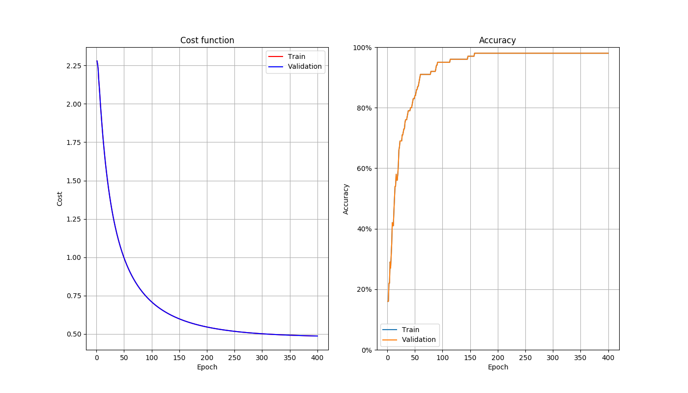  

**Two layers network**
* Momentum 0.5
  * Without BN

    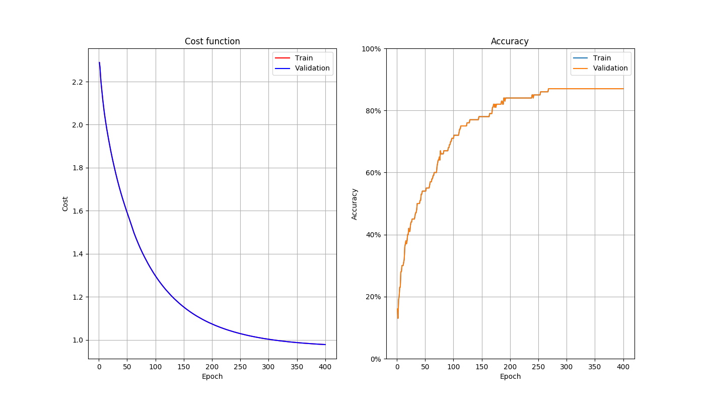  

  * With BN

    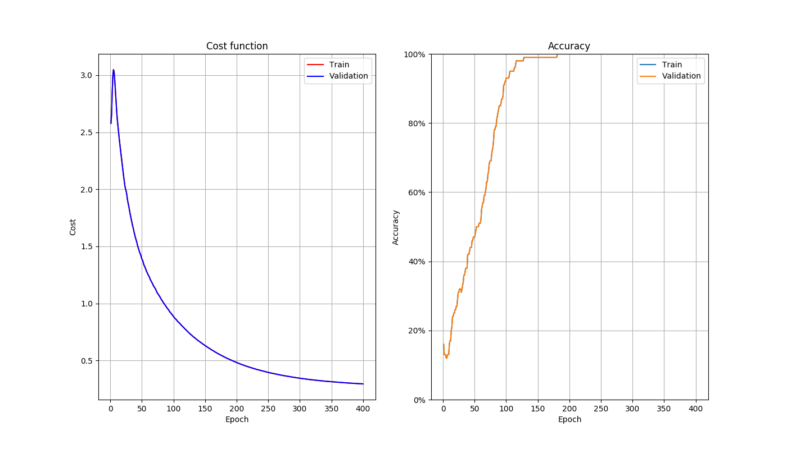  

* Momentum 0.7
  * Without BN

      

  * With BN

    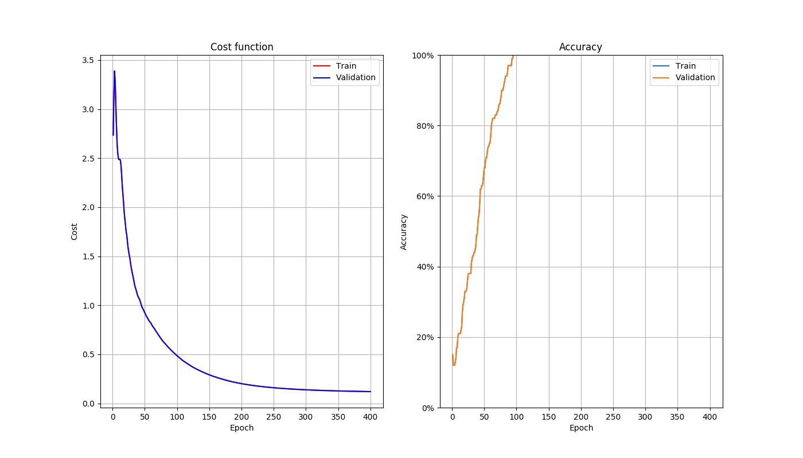  


* Momentum 0.9
  * Without BN

      

  * With BN

    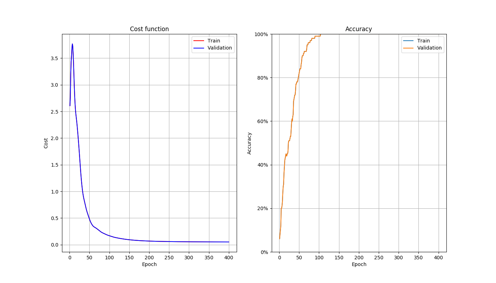  


**Three layers network**
* Without BN

  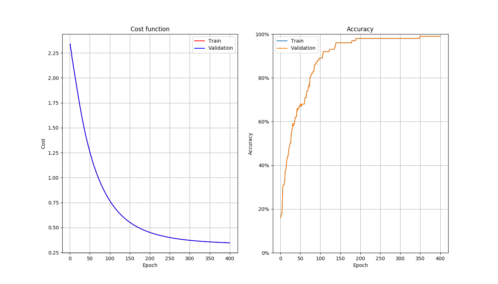

* With BN

  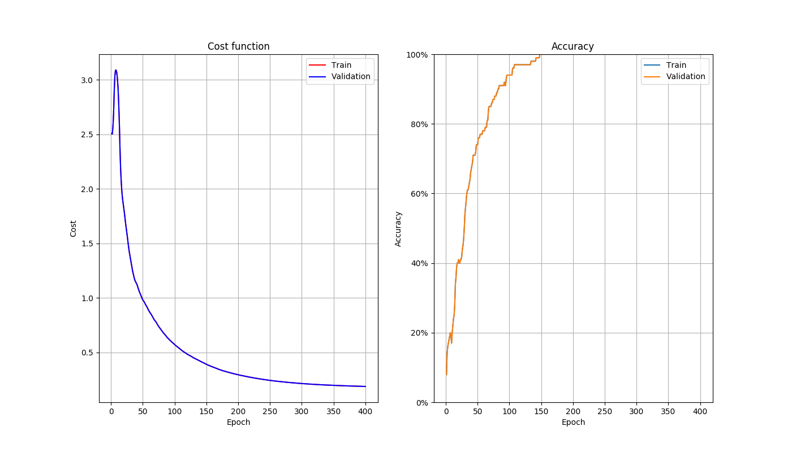

**Four layers network**
* Without BN

  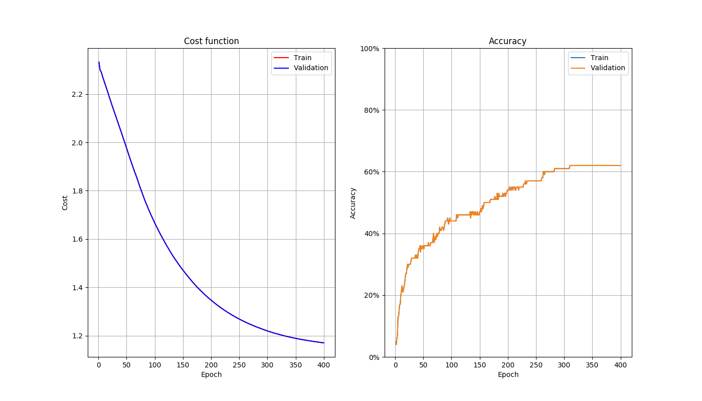

* With BN

  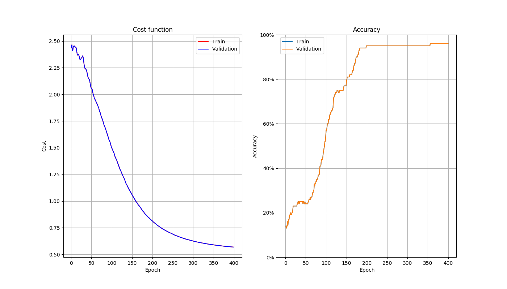

What results from these overfitting test is that:
* the MomentumSGD optimizer works fine with any network size from 1 to 4
* the one layer network and the four layer network without BN fail to reach 100% accuracy
* the effect of momentum it to speed up the learning process
* batch normalization works fine and results in faster learning
* there is a spike in the cost function near the first epochs of a batch normalized network that might imply that the gradient checks should not be done on a *cold* network

With these observations, even if the numerical tests don't check, I feel reassured that the code for backpropagation works.

## The effects of batch normalization

Here we explore the effects of batch normalization, in particular testing its efficiency in training deeper network and the speedup it brings in shallower networks.

### 1. Networks can go deeper

A deep network without batch normalization will encounter problems during training due to weight initialization and gradient propagation.
Using batch normalization instead, allows us to train deeper architectures.

#### The same three layer network with and without BN

Here follow the plots of cost and accuracy of two identical network except for the batch normalization layers.

The common parameters are:
* layer sizes 3720 -> 50 -> 30 -> 10
* initial learning rate 0.01
* decay factor 0.99
* momentum 0.8
* epochs 20
* regularization 0
* training set 2000 sample
* validation set 1000 samples

What shows is that the first network is slower in training, while the second one learns faster and reaches higher performances. Ideally we would see how the non batch normalized network fails to train where the batch normalized succeeds, but actually this effect is more evident with the four layer network used earlier to check the backpropagation. 

* Without batch normalization

  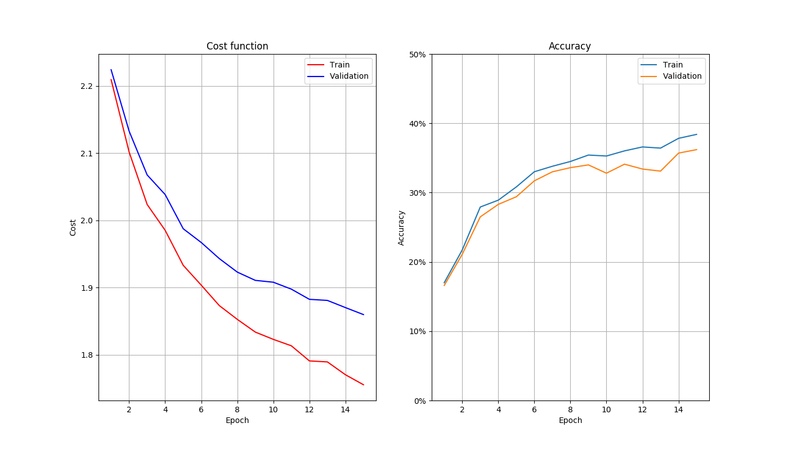

* With batch normalization

  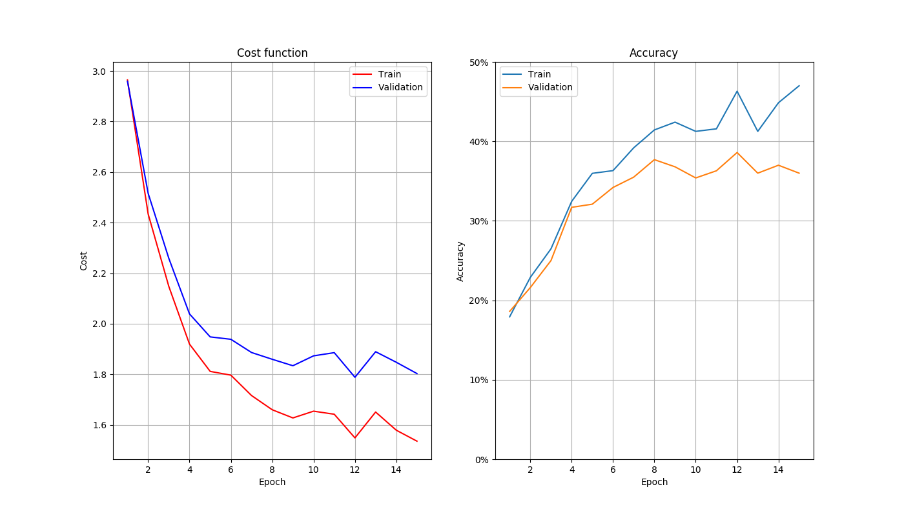

#### Hyperparameters optimization of a three layer network with batch normalization

In order to identify the best parameters for this network we iteratively explore the parameter space of learning rate and regularization weight. First we train a big number of networks with different combinations of the parameters taken from a wide range. Then we select the best performing networks and explore the parameter space near the values used for these networks. Finally, once identified a good combination of the parameters we let the network train for a longer number of epochs and test its performances against the test set.

The code for these tests is in ```go_deep.py```, where the hyper parameters other than learning rate and regularization are set to:
* layer sizes 3720 -> 50 -> 30 -> 10
* decay factor 0.99
* momentum 0.8

**Coarse search**

The coarse search uses:
* epochs 10
* training set 5000 sample
* validation set 1000 samples

Tested all the combinations of the following values for regularization and learning rate (randomly generated between 10^-4 and 0.5):

```python
regularization = [0.000192, 0.000672, 0.003772, 0.032430, 0.266132]
initial_learning_rate = [0.40573, 0.029202, 0.012721, 0.003215]
```

The three networks that best perform on the validation set are:

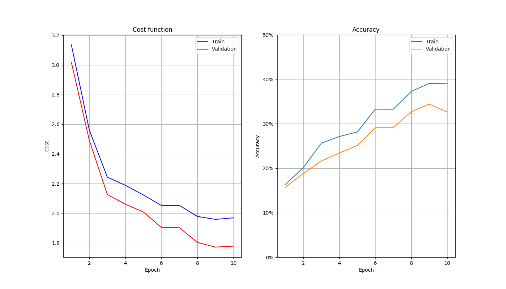

* Learning rate ```0.012721```
* Regularization ```0.000192```
* Train accuracy ```38.98%```
* Validation accuracy ```32.60%```

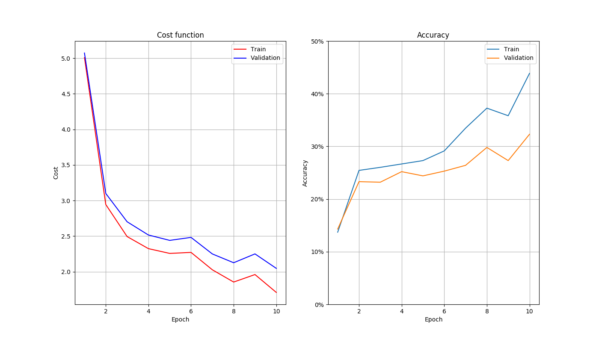

* Learning rate ```0.029202```
* Regularization ```0.000672```
* Train accuracy ```43.86%```
* Validation accuracy ```32.30%```

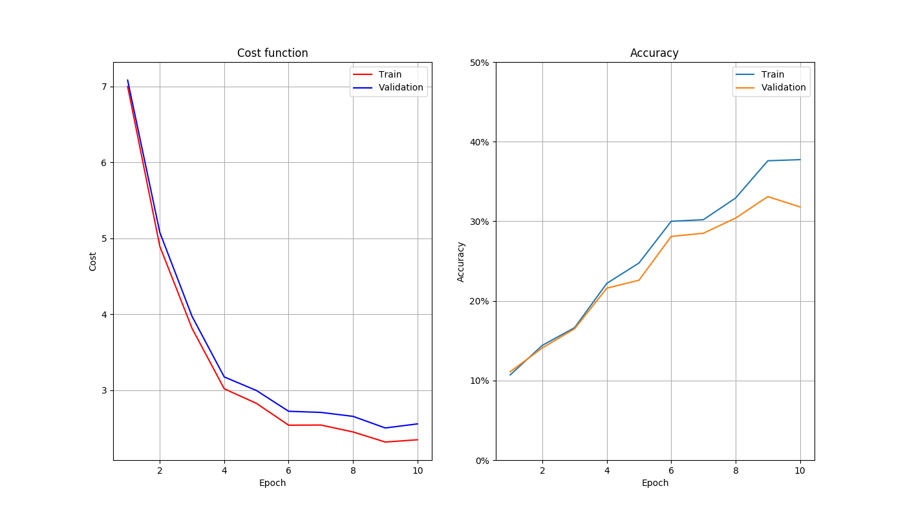

* Learning rate ```0.012721```
* Regularization ```0.003772```
* Train accuracy ```37.74%```
* Validation accuracy ```31.80%```

**Fine Search**

The fine search uses:
* epochs 15
* training set 10000 sample
* validation set 1000 samples

Tested all the combinations of the following values for regularization and learning rate (randomly generated close to the best values of the coarse search):

```python
regularization = [0.012361, 0.032430, 0.053913]
initial_learning_rate = [0.043773, 0.029202, 0.016231, 0.001051]
```

The three networks that best perform on the validation set are:


* Learning rate ```0.016231```
* Regularization ```0.012361```
* Train accuracy ```43.56%```
* Validation accuracy ```34.40%```

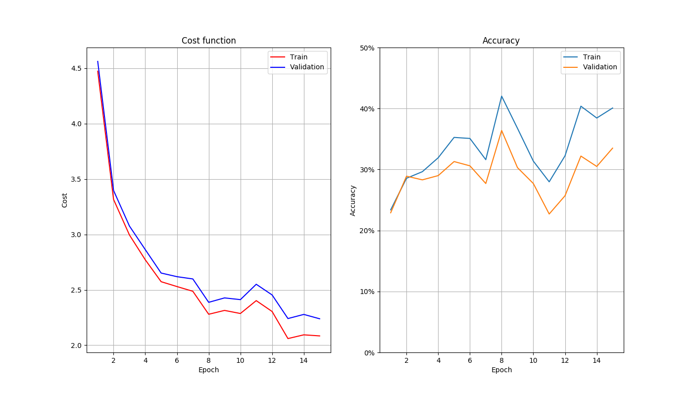

* Learning rate ```0.043773```
* Regularization ```0.012361```
* Train accuracy ```40.08%```
* Validation accuracy ```33.50%```

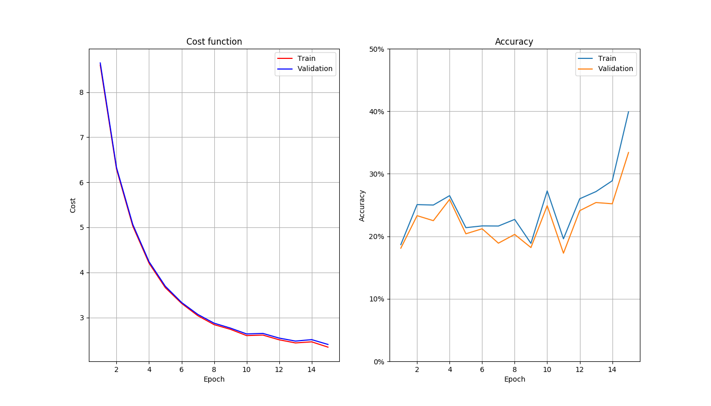

* Learning rate ```0.016231```
* Regularization ```0.053913```
* Train accuracy ```39.91%```
* Validation accuracy ```33.40%```

**Final**

The final network uses:
* Learning rate 0.029202
* Regularization 0.0001
* Epochs 20
* Training set 50000 sample
* Validation set 10000 samples
* Test set 10000 samples

Here are the cost and accuracy plots for the final training.

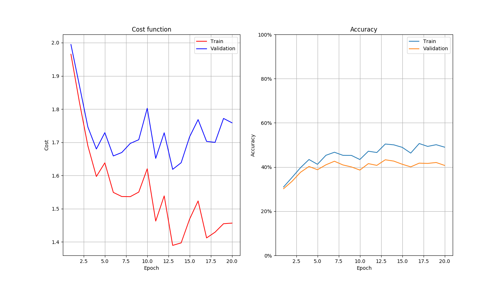

After training, the network achieves:
* accuracy of **48.99%** on the training set
* accuracy of **40.83%** on the test set


*Confusion matrix on the test set*

### 2. Networks learn faster

A batch normalized network also allows for higher learning rates and hence for faster training.

To test this we show the results of training two identical networks, that differ only for the batch normalization layers, using three different learning rates.

The common parameters are:
* layer sizes 3720 -> 50 -> 10
* decay factor 0.99
* momentum 0.8
* regularization 0
* epochs 15
* training set 10000 sample
* validation set 1000 samples

In the following, the general trend is that the batch normalized network is able to reach higher performances, often in a shorter amount of iterations.

**Learning rate 0.40573**
* Without BN

  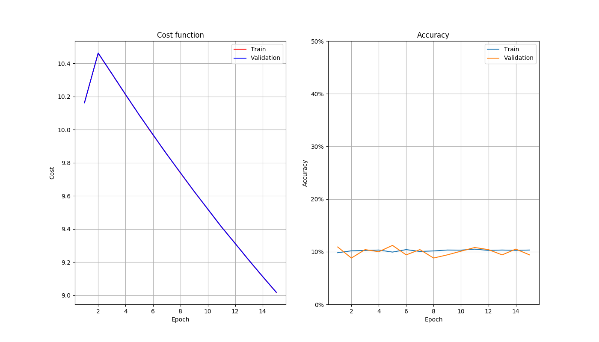

* With BN

  

**Learning rate 0.029202**
* Without BN

  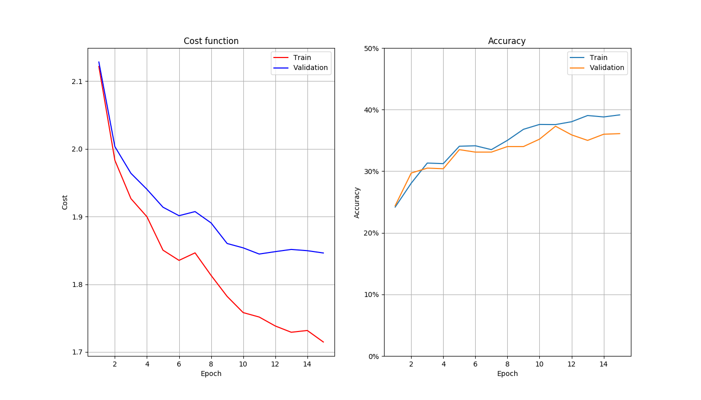

* With BN

  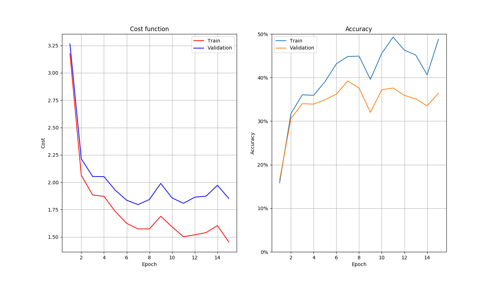

**Learning rate 0.003215**
* Without BN

  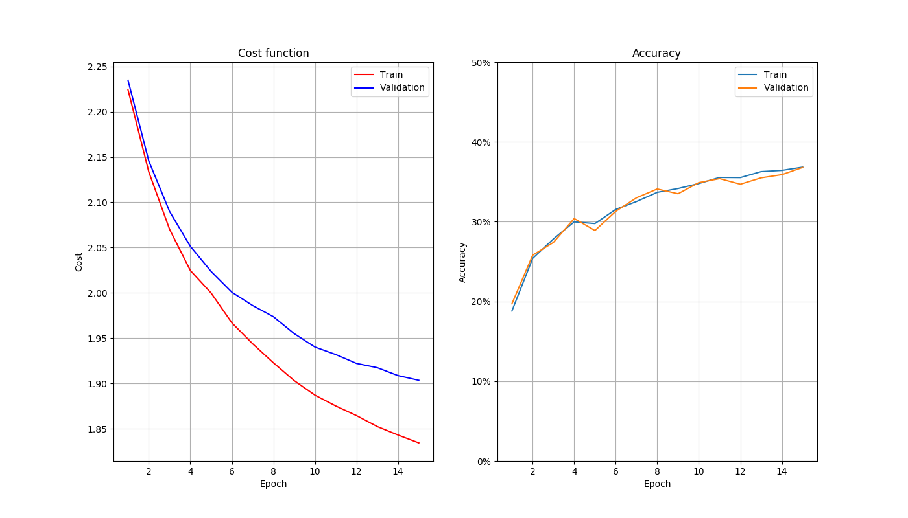

* With BN

  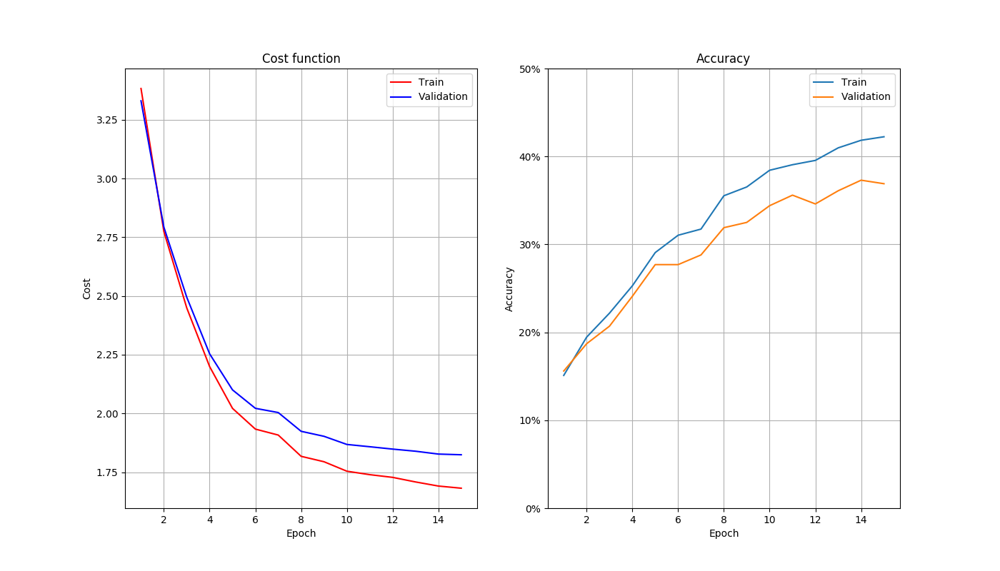
